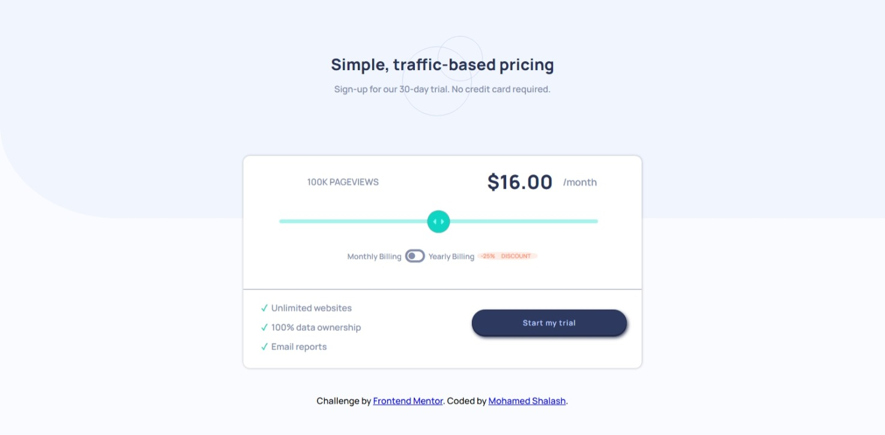

# Frontend Mentor - Interactive pricing component solution

This is a solution to the [Interactive pricing component challenge on Frontend Mentor](https://www.frontendmentor.io/challenges/interactive-pricing-component-t0m8PIyY8).

## Table of contents

- [Overview](#overview)
  - [Screenshot](#screenshot)
  - [Links](#links)
- [My process](#my-process)
  - [Built with](#built-with)
  - [What I learned](#what-i-learned)

## Overview

### Screenshot

### Links

- Solution URL: [Solution](https://github.com/shalash23/interactive-pricing-component.git)
- Live Site URL: [Website](https://sparkling-semifreddo-246599.netlify.app/)

## My process

### Built with

- Semantic HTML
- Sass
- Vanilla JavaScript

### What I learned

For some very odd reason this challenge really was such a stubborn in every aspect.
It was supposed to be so much simple but for some odd reason, it was a struggle
